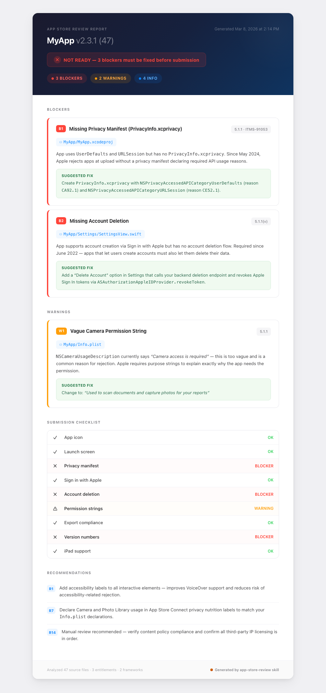

<p align="center">
  <h1 align="center">App Store Review Skill</h1>
  <p align="center">
    <strong>Stop getting rejected. Catch every issue before Apple does.</strong>
  </p>
  <p align="center">
    <a href="#quick-start">Quick Start</a> &nbsp;&bull;&nbsp;
    <a href="#what-it-catches">What It Catches</a> &nbsp;&bull;&nbsp;
    <a href="#example-output">Example Output</a> &nbsp;&bull;&nbsp;
    <a href="#how-it-works">How It Works</a>
  </p>
</p>

---

A [Claude Code](https://claude.com/claude-code) skill that scans your actual Swift code and Xcode project for App Store rejection reasons — not a checklist you read, but an automated audit that reads your files, finds problems, and tells you exactly what to fix.

<p align="center">
  
</p>

## Why?

**~40% of iOS apps get rejected on first submission.** The top reasons are all preventable:

- Missing `PrivacyInfo.xcprivacy` (ITMS-91053) — the #1 rejection reason since 2024
- Vague privacy permission strings ("Camera access needed")
- No account deletion flow (required since 2022)
- Widget extensions missing their own privacy manifest
- Hardcoded API keys, placeholder text, missing app icons

These aren't hard problems. They're easy to miss, tedious to check manually, and painful to discover after waiting days for Apple's review.

**This skill checks all of them in one pass.** It reads your `project.pbxproj`, every `Info.plist`, all your Swift files, entitlements, and asset catalogs — then produces a report with the exact file, line number, and fix for each issue.

## Quick Start

Install the skill in Claude Code:

```
/install-skill /path/to/app-store-review
```

Then open any Xcode project and say:

```
Review my app for the App Store
```

That's it. You'll get a full report in about 3–5 minutes.

## What It Catches

### 53 Automated Checks

Every check scans your actual source code with specific regex patterns and validation rules. Issues are classified by severity:

| Severity | Meaning |
|----------|---------|
| **BLOCKER** | Apple will reject your app. Must fix before submitting. |
| **WARNING** | Likely rejection or review delay. Should fix. |
| **INFO** | Best practice. Won't cause rejection but improves quality. |

<details>
<summary><strong>Privacy & Data</strong> — 7 checks</summary>

- Privacy usage descriptions in Info.plist
- PrivacyInfo.xcprivacy with Required Reason APIs
- AI/ML service disclosure
- Export compliance declaration
- Third-party SDK privacy manifests
- App Tracking Transparency consistency
- Sensitive data in UserDefaults vs Keychain
</details>

<details>
<summary><strong>UI & Assets</strong> — 8 checks</summary>

- App icon (1024x1024, no alpha)
- Launch screen configuration
- iPad support and device family
- Permission string quality (specific, not vague)
- Minimum functionality (not just a WebView wrapper)
- Broken or placeholder links
- Hardcoded prices in UI strings
- Placeholder and debug content ("Lorem ipsum", TODO, test URLs)
</details>

<details>
<summary><strong>Entitlements & Config</strong> — 8 checks</summary>

- Entitlements file consistency across targets
- App Transport Security exceptions
- Version and build numbers
- Deployment target and SDK version
- Extension, widget, and App Group requirements
- URL scheme conflicts
- TestFlight vs App Store differences
- Background mode justification (no silent audio abuse)
</details>

<details>
<summary><strong>Features & Compliance</strong> — 10 checks</summary>

- Sign in with Apple (required if any social login)
- Account deletion flow
- In-app purchase configuration
- User-generated content moderation
- Subscription paywall requirements
- HealthKit special requirements
- Kids category / COPPA compliance
- Restore purchases button
- Loot box odds disclosure
- VPN API compliance (must use NEVPNManager)
- Medical and health disclaimers
</details>

<details>
<summary><strong>Code Quality</strong> — 11 checks</summary>

- Crash-risk patterns (force unwrap, force try)
- Hardcoded IPv4 addresses
- Private API usage
- Hardcoded secrets and API keys
- Missing API availability checks
- Deprecated framework usage
- Dynamic code execution
- GPL license dependencies
- Resource abuse (aggressive polling, continuous location)
- Biometric auth API compliance (LocalAuthentication, not ARKit)
- On-device crypto mining detection
</details>

<details>
<summary><strong>Third-Party & Metadata</strong> — 9 checks</summary>

- Feature flags and remote config
- Review notes checklist
- Platform reference violations ("Android", "Google Play")
- Apple trademark in bundle ID
- Common SDK configuration issues
- Binary size estimation
- Firebase / backend security rules
- Extension and widget ad prohibition
- Hardcoded prices
</details>

### 14 Recommendations

Beyond pass/fail checks, the report includes actionable recommendations:

- **R1** Performance optimization (large images, synchronous network calls)
- **R2** Accessibility (VoiceOver labels, Dynamic Type support)
- **R3** Error handling and edge cases
- **R4** App Store Connect metadata preparation
- **R5** Data persistence and backup strategy
- **R6** Concurrency and threading
- **R7** Privacy nutrition label mapping (SDK → data types to declare)
- **R8–R10** Security hardening, push notification setup, widget optimization
- **R11–R12** Synchronous call detection, localization completeness
- **R13** External verification checklist (Firebase, push certs, Universal Links)
- **R14** Manual review items (content policy, IP, gambling — things code can't check)

## Example Output

Here's what a real report looks like (abbreviated):

```
# App Store Review Report — MyApp

**Readiness: NOT READY** — 3 blockers must be fixed before submission.

## BLOCKERS

### [B1] Missing Privacy Manifest (PrivacyInfo.xcprivacy)
- **Guideline**: 5.1.1 (ITMS-91053)
- **File**: MyApp/MyApp.xcodeproj
- **Issue**: App uses UserDefaults and URLSession but has no PrivacyInfo.xcprivacy.
  Since May 2024, Apple rejects at upload time.
- **Fix**: Create PrivacyInfo.xcprivacy with NSPrivacyAccessedAPICategoryUserDefaults
  (reason CA92.1) and NSPrivacyAccessedAPICategoryURLSession (reason CE52.1).

### [B2] Missing Account Deletion
- **Guideline**: 5.1.1(v)
- **File**: MyApp/Settings/SettingsView.swift
- **Issue**: App supports Sign in with Apple but has no account deletion flow.
- **Fix**: Add "Delete Account" in Settings that calls your backend deletion
  endpoint and revokes Apple Sign In tokens via Token Revocation endpoint.

## WARNINGS

### [W1] Vague Camera Permission String
- **Guideline**: 5.1.1
- **File**: MyApp/Info.plist
- **Issue**: NSCameraUsageDescription says "Camera access is required" — too vague.
- **Fix**: "Used to scan documents and capture receipt photos for expense reports"

## Checklist
[x] Privacy manifest — 1 BLOCKER
[ ] App icon — OK
[ ] Sign in with Apple — OK
[x] Account deletion — 1 BLOCKER
[x] Permission strings — 1 WARNING
```

Each issue includes the **exact file path**, **line number** where possible, the **Apple guideline** being violated, and a **specific fix** — not generic advice.

## How It Works

The skill follows a 4-phase process:

1. **Discover** — Finds your `.xcodeproj`, enumerates all targets (main app, widgets, extensions), maps the project structure
2. **Scan** — Runs all 53 checks against your actual source files using regex patterns and validation rules
3. **Report** — Generates a structured report with severity tiers, a checklist summary, and draft review notes
4. **Recommend** — Adds targeted recommendations based on what it found (only relevant ones, not a generic list)

The skill reads reference files on-demand to stay efficient — the main instructions are ~185 lines, with detailed check definitions and recommendations loaded only when needed.

## Project Structure

```
app-store-review/
├── SKILL.md                        # Main skill (phases, report format, behavioral notes)
├── references/
│   ├── checks.md                   # All 53 check definitions with search patterns
│   ├── recommendations.md          # 14 recommendation categories
│   ├── approval-guide.md           # First-submission approval guide
│   └── privacy-keys.md             # Info.plist privacy key reference
└── evals/
    ├── evals.json                  # Test case definitions with assertions
    └── trigger-eval.json           # Trigger accuracy test queries
```

## Tested On

The skill has been validated against real-world iOS projects:

| App | Type | Targets | Result |
|-----|------|---------|--------|
| Multi-target app with widgets | Production SwiftUI + Firebase | 2 targets | 13/13 assertions pass |
| Metal shader physics app | SwiftUI + Metal + AudioKit | 1 target | 9/9 assertions pass |
| Simple SpriteKit game | Single-view game | 1 target | 7/7 assertions pass |

100% pass rate across 29 assertions covering accuracy, false-positive avoidance, and report quality.

## License

MIT
